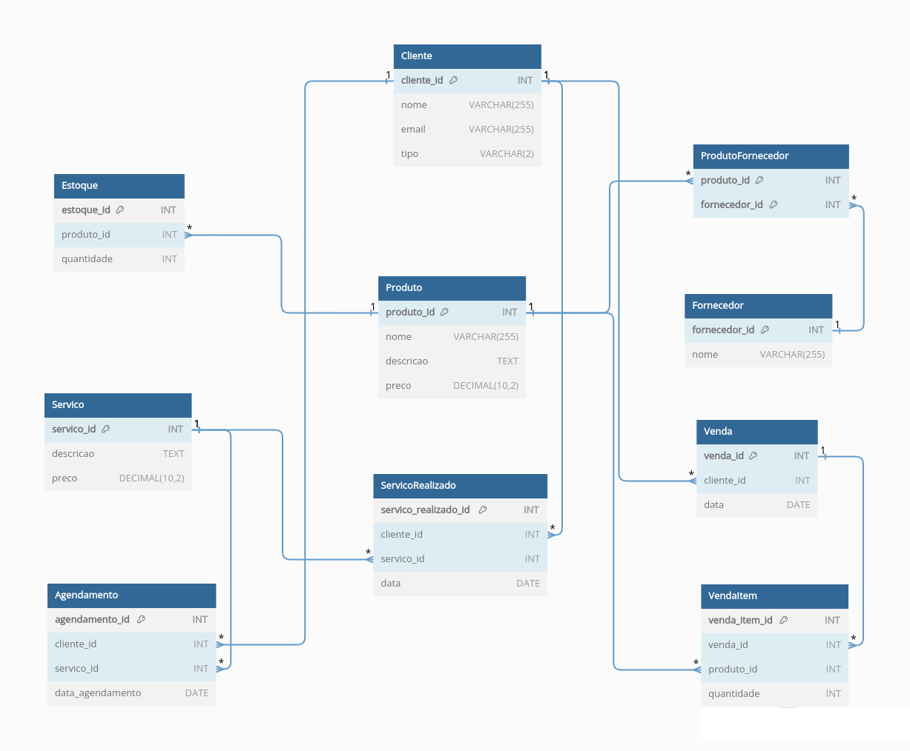

# Projeto Lógico de Banco de Dados para Oficina Automotiva

Este é o repositório que contém o projeto de modelagem de banco de dados para uma oficina automotiva, criado como parte do desafio do módulo de modelagem de banco de dados com modelo ER para o Bootcamp Potência Tech powered by iFood | Ciência de Dados da DIO. O projeto inclui a criação do esquema lógico do banco de dados, a implementação do script SQL para criação das tabelas e a persistência de dados para realização de testes.

## Sobre o Projeto

Neste projeto, criamos o esquema lógico para uma oficina automotiva, considerando as diferentes entidades e relacionamentos envolvidos no processo de gerenciamento de serviços e peças automotivas.

## Diagrama de Relacionamento de Entidade (ERD)
Aqui está o diagrama visual que ilustra os relacionamentos entre as tabelas do esquema de banco de dados da oficina automotiva:

## Esquema Lógico

O esquema lógico foi derivado do modelo ER apresentado no desafio do projeto [de modelagem de banco de dados para um sistema de e-commerce](https://github.com/souzabarbara/projeto-1-banco-de-dados-dio). Foram criadas tabelas para as entidades Cliente, Conta, Pagamento, Produto, Estoque, Fornecedor, ProdutoFornecedor, Pedido, PedidoItem e Entrega. As chaves primárias e estrangeiras foram definidas de acordo com as especificações do desafio.

## Funcionalidades Implementadas

-   Modelagem lógica das tabelas conforme especificações do desafio.
-   Definição de chaves primárias e estrangeiras para estabelecer os relacionamentos.
-   Criação do script SQL para criar o esquema do banco de dados.
-   Implementação de queries SQL para diferentes tipos de consultas, incluindo recuperações simples, filtros, expressões, ordenações, condições de grupo e junções entre tabelas.

## Como Utilizar

1.  Clone este repositório para sua máquina local usando o seguinte comando:
  
    
    `git clone https://github.com/SEU_USUARIO/nome-do-repositorio.git` 
    
2.  Execute o script SQL `create_tables.sql` em um sistema de gerenciamento de banco de dados compatível para criar o esquema do banco de dados.
    
3.  Utilize as queries SQL disponíveis em `queries.sql` para testar diferentes tipos de consultas no banco de dados criado.
    
4.  Personalize as consultas ou adicione novas conforme necessário para explorar os dados e responder às perguntas propostas.
    

## Perguntas de Análise

As seguintes perguntas foram exploradas através das consultas SQL no projeto:

-   Quantos produtos estão disponíveis em estoque?
-   Quais clientes realizaram mais pedidos?
-   Qual é o valor total dos pedidos realizados em um determinado período?
-   Quais são as peças fornecidas por cada fornecedor?
-   Quais são os detalhes das entregas agendadas?

## Contribuição

Contribuições são bem-vindas! Se você identificar melhorias nas consultas, otimizações no esquema do banco de dados ou correções, sinta-se à vontade para abrir uma issue ou um pull request.

## Contato

Para mais informações, entre em contato via email: [barbarasouza.dev@gmail.com](mailto:barbarasouza.dev@gmail.com).